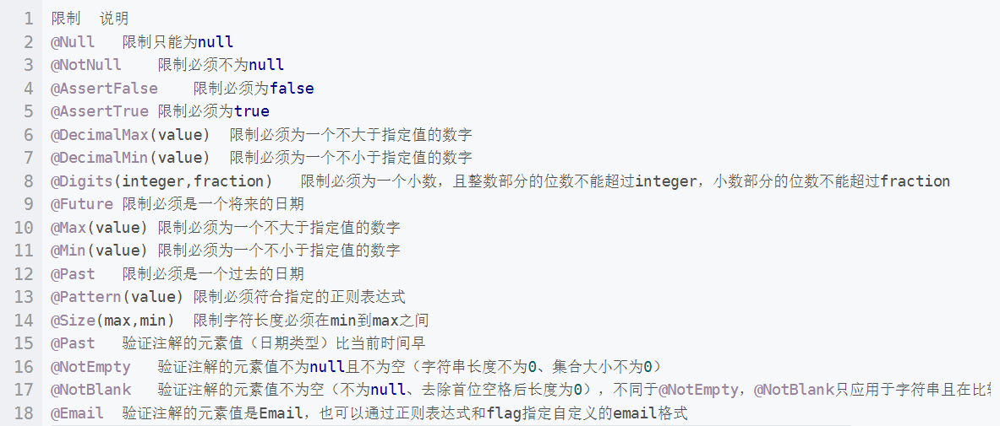

# 架构和特点

# 统一配置

## 加密方式

* 两次MD5加密

~~~text
用户端：PASS=MD5(明文+固定Salt)
服务端：PASS=MD5(用户输入+随机Salt)

用户端MD5加密是为了防止用户密码在网络中明文传输，服务端MD5加密是为了提高密码安全性，双重保险
~~~

* MD5Utils.java
~~~java
/**
 * @description:说明 MD5工具类
 */
public class MD5Utils {

    //固定盐
    private static final String salt ="1a2b3c4d";

    /**
     * MD5加密方法
     * */
    public static String md5(String src){
        return DigestUtils.md2Hex(src);
    }

    /**
     * 第一次加密
     * */
    public static String inputPassToFromPass(String inputPass){
        String str = salt.charAt(0)+salt.charAt(2)+inputPass+salt.charAt(5)+salt.charAt(4);
        return md5(str);
    }

    /**
     * 第二次加密
     * */
    public static String fromPassToDBPass(String formPass,String salt){
        String str = salt.charAt(0)+salt.charAt(2)+formPass+salt.charAt(5)+salt.charAt(4);
        return md5(str);
    }

    /**
     * 调用的方法
     * */
    public static String inputPassToDBPass(String inputPass,String salt){
        String fromPass = inputPassToFromPass(inputPass);
        String dbPass = fromPassToDBPass(fromPass, salt);
        return dbPass;
    }

    //主方法 用于测试
    public static void main(String[] args) {

        System.out.println(inputPassToFromPass("123456"));//82a693d3173db016d77c59a41d302b20
        System.out.println(fromPassToDBPass("82a693d3173db016d77c59a41d302b20","1a2b3c4d"));//a0de3e469073b293e3187df16fe5a6a2
        System.out.println(inputPassToDBPass("123456","1a2b3c4d"));//a0de3e469073b293e3187df16fe5a6a2

    }
~~~

## 统一返回结果

* 统一返回对象 枚举类

~~~java
@Getter
@ToString
@AllArgsConstructor
public enum RespBeanEnum {

    //通用枚举
    SUCCESS(200,"success"),
    ERROR(500,"服务异常"),

    //登录枚举
    LOGIN_ERROR(501,"登录名或密码不正确"),
    MOBILE_ERROR(502,"手机号码格式不正确"),

    //参数校验异常
    BIND_ERROR(503,"参数校验异常"),

    //秒杀
    EMPTY_STOCK(500500,"库存不足"),
    REPEATE_ERROR(500501,"每人限购一件"),

    //TODO 扩展
    
    ;

    private final Integer code; //状态码
    private final String message; //信息

}
~~~

* 统一返回对象

~~~java
@Data //省略get set方法
@NoArgsConstructor
@AllArgsConstructor
public class RespBean {

    private long code;//状态码
    private String message;//消息
    private Object obj;//对象

    /**
     * 通用返回成功 结果
     * */
    public static RespBean success(){
        return new RespBean(RespBeanEnum.SUCCESS.getCode(), RespBeanEnum.SUCCESS.getMessage(), null);
    }

    /**
     * 返回成功 重载带Object
     * */
    public static RespBean success(Object obj){
        return new RespBean(RespBeanEnum.SUCCESS.getCode(), RespBeanEnum.SUCCESS.getMessage(), obj);
    }

    /**
     * 通用返回失败 结果
     * */
    public static RespBean error(RespBeanEnum beanenum){
        return new RespBean(beanenum.getCode(),beanenum.getMessage(),null);
    }

    /**
     * 返回失败 重载带Object
     * */
    public static RespBean error(RespBeanEnum beanenum,Object obj){
        return new RespBean(beanenum.getCode(),beanenum.getMessage(),obj);
    }
    
    //TODO 扩展
    
}
~~~

## 参数校验

* 添加参数校验依赖

~~~xml
<!--validation 参数校验 @Valid-->
<dependency>
    <groupId>org.springframework.boot</groupId>
    <artifactId>spring-boot-starter-validation</artifactId>
</dependency>
~~~

* 在需要参数校验的参数前 添加 @Valid 注解

* 在参数VO类的参数上 添加约束条件

~~~java
@Data
public class LoginVo {

    @NotNull
    @IsMobile
    private String mobile;
    @NotNull
    @Length(min = 32)
//    @Size(min = 32)
    private String password;
}
~~~

* 限制条件说明
  

## 自定义参数校验

* 自定义注解 IsModel（用于验证手机号）
~~~java
@Target({ElementType.METHOD, ElementType.FIELD, ElementType.ANNOTATION_TYPE, ElementType.CONSTRUCTOR, ElementType.PARAMETER, ElementType.TYPE_USE})
@Retention(RetentionPolicy.RUNTIME)
@Documented
@Constraint(
        validatedBy = {IsMobileValidator.class} //自定义规则类
)
public @interface IsMobile {

    boolean required() default true;

    String message() default "手机号码格式错误";

    Class<?>[] groups() default {};

    Class<? extends Payload>[] payload() default {};
}
~~~

* 自定义规则类
~~~java
public class IsMobileValidator implements ConstraintValidator<IsMobile,String> {

    //初始化参数为false
    private boolean required = false;

    @Override
    public void initialize(IsMobile constraintAnnotation) {
        required = constraintAnnotation.required();//接收参数
    }

    //校验规则
    @Override
    public boolean isValid(String value, ConstraintValidatorContext constraintValidatorContext) {

        if (required){ //必填
            return ValidatorUtil.isMobile(value);
        }else { //非必填
            if (StringUtils.isEmpty(value)){
                return true;
            }else {
                return ValidatorUtil.isMobile(value);
            }
        }
    }
}
~~~

* 具体参数校验规则类
~~~java
public class ValidatorUtil {

    //正则表达式 校验格式
    private final static Pattern mobile_pattern = Pattern.compile("[1]([3-9])[0-9]{9}$");

    /**
     * 校验方法
     *  参数不为空
     *  校验格式
     * */
    public static boolean isMobile(String mobile){

        if (ObjectUtils.isEmpty(mobile)){
            return false;
        }
        Matcher matcher = mobile_pattern.matcher(mobile);
        return matcher.matches();
    }
}
~~~

## 全局统一异常处理

* 定义全局异常类，继承 RuntimeException

~~~java
@Data
@AllArgsConstructor
@NoArgsConstructor
public class GlobalException extends RuntimeException {
    //公共返回枚举对象
    private RespBeanEnum respBeanEnum;
}
~~~

* 定义全局异常处理类，用于拦截异常并打印

~~~java
/**
 * 定义 @ControllerAdvice 注解
 * 定义 @ExceptionHandler 注解，声明拦截哪种异常
 * 
 * */
@RestControllerAdvice
public class GlobalExceptionHandler {

    @ExceptionHandler(Exception.class) //声明拦截哪种异常
    public RespBean ExceptionHandler(Exception e){

        System.out.println("统一返回异常信息：" + e);

        //具体异常分析
        if (e instanceof GlobalException){
            GlobalException ge = (GlobalException) e;
            return RespBean.error(ge.getRespBeanEnum());
        }else if (e instanceof BindException){
            BindException be = (BindException) e;
            RespBean respBean = RespBean.error(RespBeanEnum.BIND_ERROR);
            respBean.setMessage("参数校验异常："+be.getBindingResult().getAllErrors().get(0).getDefaultMessage());
            return respBean;
        }
        return RespBean.error(RespBeanEnum.ERROR);
    }
}
~~~

* 把统一返回结果集 改为 抛出统一异常
~~~java
return RespBean.error(RespBeanEnum.LOGIN_ERROR);
//修改为
throw new GlobalException(RespBeanEnum.LOGIN_ERROR);
~~~

## 分布式 Session 问题

### Session复制

~~~text
优点
    无需修改代码 只需要修改Tomcat配置

缺点
    Session同步传输占用内网带宽
    多台Tomcat同步性能指数级下降
    Session占用内存，无法有效水平扩展
~~~

### 前端存储
~~~text
优点
    不占用服务器内存

缺点
    存在安全风险
    数据大小受cookie限制
    占用外网带宽
~~~

### Session 

